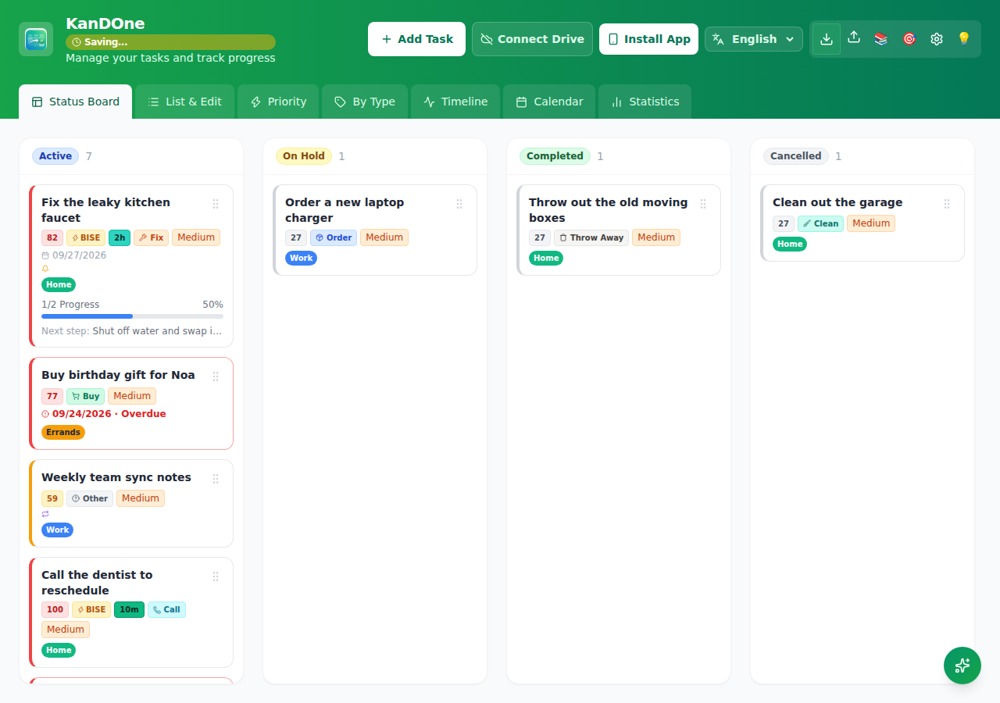
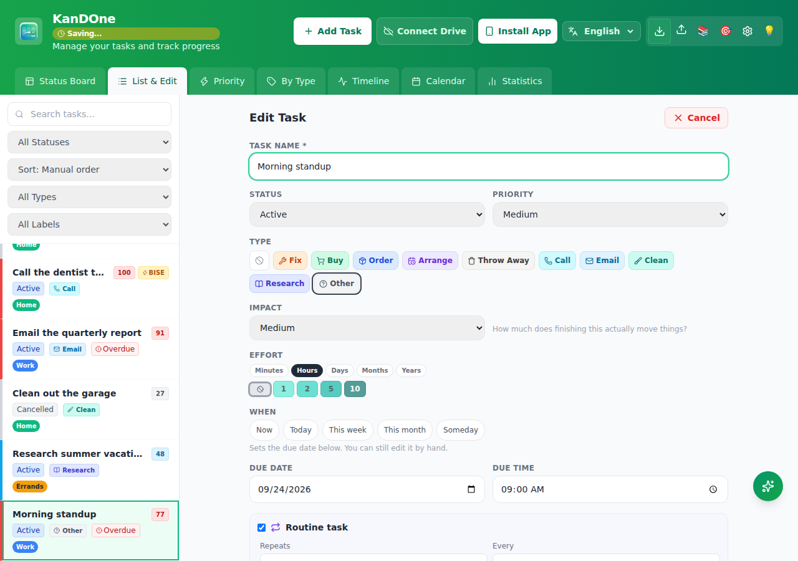
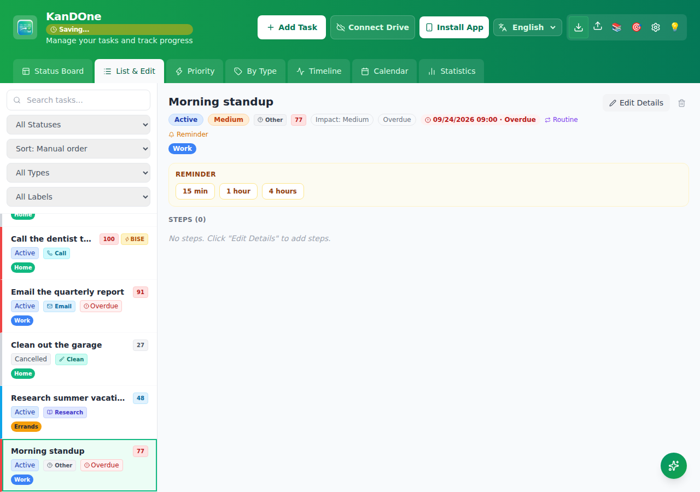
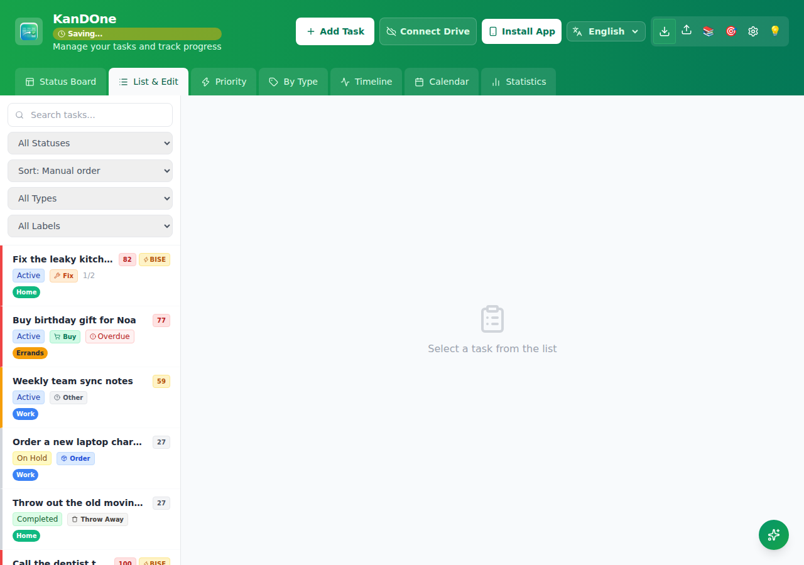
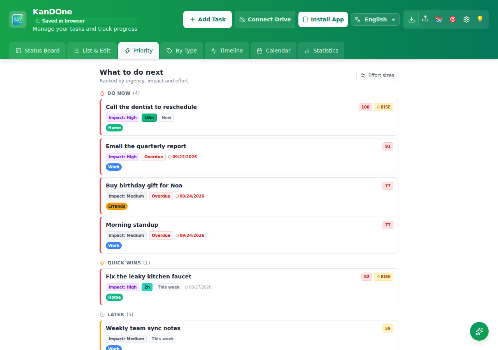
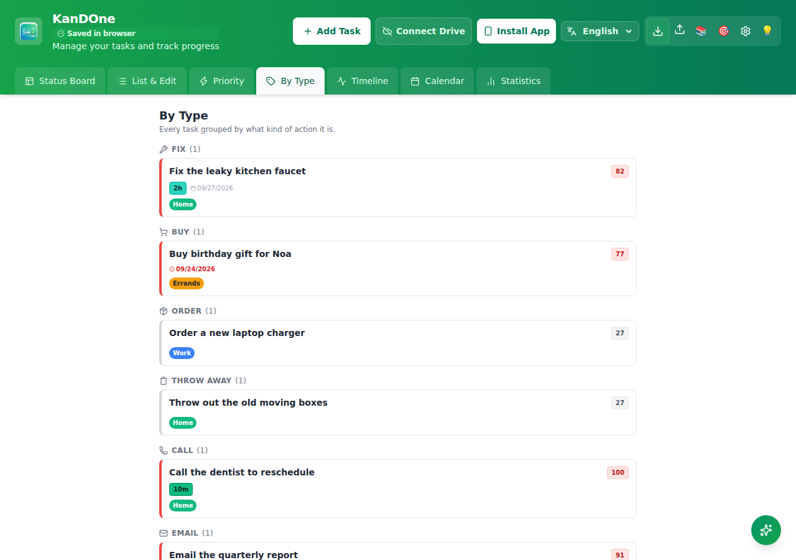
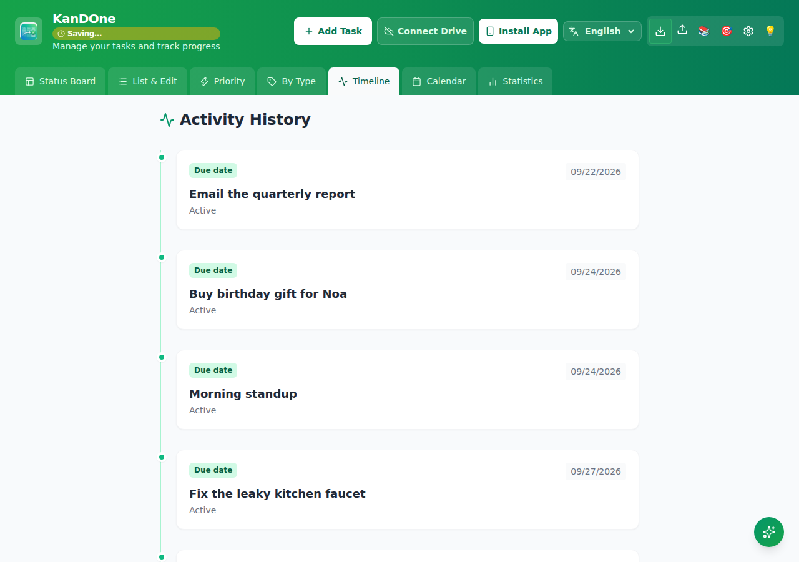
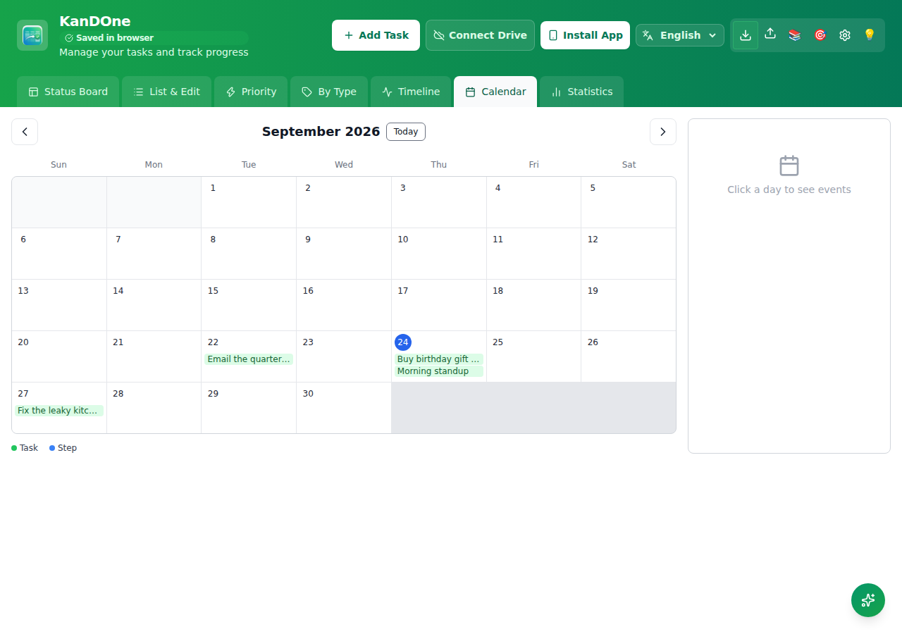
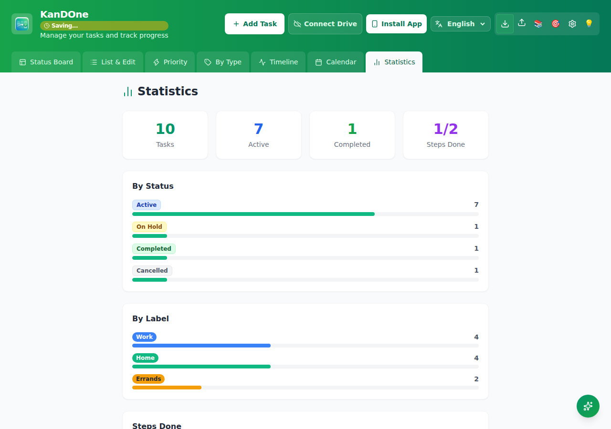
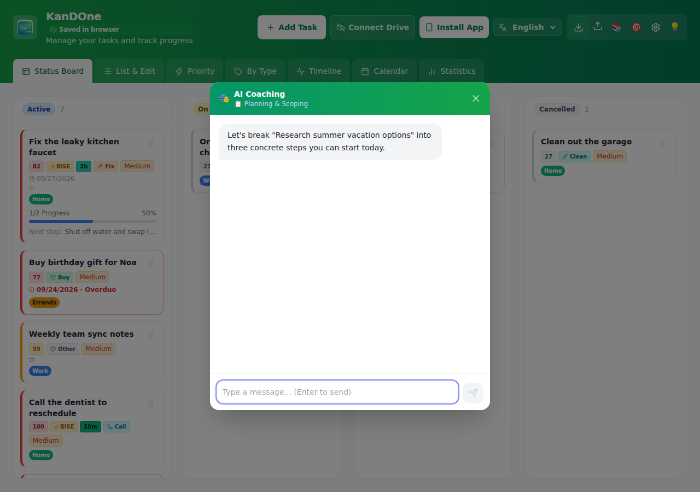

# KanDOne

A standalone Kanban task-management app — ported from the **Tasks mode** of JobFlowTracker into its own repo.

Plan work as tasks with sub-steps, and see the same data seven ways: a Kanban
board, a filterable list/edit view, a priority ranking, a by-type breakdown, a
timeline, a calendar, and stats — with optional AI coaching and Firebase cloud
sync. Offline-first (localStorage), installable as a PWA, and localized in
English, Hebrew (RTL) and French.

## Screenshots

### Kanban board with labels, routines & reminders



### Task form — routines, due time & reminders (Phase B)



### Task detail — metadata at a glance



### List & Edit — search, filter, and sort every task



### Priority — ranked by urgency, impact and effort

Buckets tasks into **Do Now**, **Quick Wins** (high impact, low effort — the
BISE badge), and **Later**, so the next thing to do is always at the top:



### By Type — every task grouped by what kind of action it is



### Timeline — activity history in order



### Calendar — due dates and steps by day



### Statistics — breakdown by label



### AI Coaching — bring-your-own-key task planning help

The coach reads the task you're planning and helps break it down — here,
inside the Kanban board:



To regenerate these images locally:

```bash
npm run dev -- --host 127.0.0.1 --port 5199 --strictPort   # in another terminal
npx playwright test e2e/screenshots.spec.js
```

## Features

| Area | Capabilities |
| --- | --- |
| **Core** | Kanban board, list/edit, priority ranking, by-type grouping, timeline, calendar, statistics |
| **Steps** | Sub-tasks with status cycling (`todo → in_progress → done → blocked`) |
| **Phase A** | Custom labels & colors, per-task card color, estimated duration, label filter & stats |
| **Phase B** | Optional due time, recurring routine tasks (daily/weekly/monthly), browser reminders |
| **UX** | Overdue highlighting; Undo toast for delete task/step/label and import overwrite |
| **Data** | Auto-save to `localStorage`, JSON backup (tasks + labels), optional Google/Firestore sync |
| **AI** | Task coach, template sessions, goals finder (bring-your-own API key) |
| **PWA** | Installable, works offline once loaded |
| **A11y / i18n** | `html` lang/dir sync, en/he/fr with locale parity tests, dialog focus trapping |

### Routine tasks

Mark a task as a **routine** and choose daily, weekly (with weekday picker), or monthly
recurrence. When the task is moved to **Completed** (board drag or save), KanDOne resets
its steps, keeps it **Active**, and advances the due date to the next occurrence.

### Reminders

Enable a **reminder** with an offset (at due time, 15 min … 1 day before). KanDOne
requests browser notification permission and fires reminders while the app is open or
installed as a PWA.

## Stack

React 19 · Vite · Tailwind CSS · i18next · Firebase (Auth + Firestore) · Vitest · Playwright

## Getting started

```bash
npm install
npm run dev           # start dev server (http://localhost:5173)
npm run build         # production build
npm run build:analyze # production build + rollup visualizer report
npm test              # run unit tests
npm run test:e2e      # Playwright browser tests (port 5199)
npm run test:all      # unit + e2e
npm run lint          # eslint (also runs in CI)
```

## Documentation

- [High Level Design (HLD)](docs/HLD.md) — architecture, flows, integrations, audit A–I summary
- [Low Level Design (LLD)](docs/LLD.md) — modules, data shapes, function map

## Project layout

<!-- BEGIN GENERATED TREE (depth=1 entries=all) -->
```text
KanDOne/
├── .github/
├── docs/
├── e2e/            # Playwright end-to-end tests
├── public/
├── src/            # App source — single entry point (TasksApp.jsx), no mode gate (unlike…
├── .ai             # Ogen-ai submodule — the shared source of rules, skills and the ai-sync…
├── .env.example
├── .gitignore
├── .gitleaks.toml
├── .gitleaksignore
├── .gitmodules
├── .npmrc
├── .trivyignore
├── AGENTS.md       # The compiled coding rules every AI assistant reads — generated, do not…
├── CLAUDE.md       # Claude Code's copy of AGENTS.md (generated)
├── GEMINI.md       # Gemini CLI's copy of AGENTS.md (generated)
├── LICENSE
├── README.md       # KanDOne
├── SECURITY.md     # Security Policy
├── ai-config.toml  # Which rule fragments and target tools ai-sync compiles for this repo
├── eslint.config.js
├── firestore.rules
├── index.html
├── package-lock.json
├── package.json
├── playwright.config.js
├── postcss.config.js
├── tailwind.config.js
├── vercel.json
└── vite.config.js
```
<!-- END GENERATED TREE -->

Full annotated tree, every file: [`docs/STRUCTURE.md`](docs/STRUCTURE.md). Generated —
regenerate after adding/renaming a file with:
```bash
python .ai/skills/repo_tree/gen_tree.py --project . --output docs/STRUCTURE.md
python .ai/skills/repo_tree/gen_tree.py --project . --output README.md --max-depth 1
```

## What was carried over

Everything the Tasks feature needs, standalone:

- `TasksApp.jsx` — the full tasks UI (board / list / timeline / calendar / stats)
- Task data model + persistence: `sanitize.js`, `storageKeys.js`, `statuses.js`, `firebase.js`
- AI coaching: `services/aiAssistant.js`, `components/ChatModal.jsx`, template prompts
- Supporting UI: `CalendarView`, `TemplateLibrary`, `APIKeySettings`, `Onboarding`, `AppBrandMark`
- i18n: `en` / `he` / `fr` locales

The multi-mode architecture (jobseeker / recruiter modes, mode selection screen, mode
switcher/dropdown) was removed — `App.jsx` boots straight into the tasks view. Dead
interview-template assets were removed in a later cleanup.

## Notes

- Cloud sync is configured through the `VITE_FIREBASE_*` variables — see `.env.example`.
  Each is optional and overrides one value of the app's own project, which
  `resolveFirebaseConfig()` in `src/firebase.js` falls back to; set them to point a fork
  or preview deploy at its own Firebase project. A build with none of them set still has
  working sync. The values are public web client identifiers, not secrets — they ship in
  the bundle by design, and access is controlled by `firestore.rules` and Authentication →
  Authorized domains. The SDK still loads lazily, only when a cloud API is first used.
- Local changes that have not reached Firestore are tracked per record id in
  `src/utils/pendingSync.js`, and `resolveTasksOnSignIn` uses that set to decide a shared
  id: a pending local edit wins over the pulled copy and is pushed up, a pending local
  delete is not resurrected, and everything else takes cloud. Without it a pull overwrote
  every id it shared, discarding edits made before a returning session finished resolving.
- Labels are stored in `localStorage` (`tasksLabelsV1`) and synced to the user
  profile in Firestore (`tasksLabels` field) when signed in; also included in JSON export v2.
- Reminders require the app to be open (or running as an installed PWA); background
  service-worker scheduling is not implemented in v1.
- AI API keys are stored in plaintext `localStorage` by design (no backend proxy). The
  settings modal warns about this; treat it as an accepted privacy trade-off.
- Calendar UI is forced light for readability; under OS dark mode it stays a light panel
  (stray Tailwind `dark:` classes were removed to avoid white-on-white text).
- CSP uses `script-src 'self'` (plus Google/Firebase origins) — no `'unsafe-inline'` for
  scripts. The same policy is set in `index.html` and as a Vercel response header.
- Board card drag uses HTML5 DnD (desktop). Touch drag and manual within-column ordering
  are not implemented yet.
- A render crash shows a recovery screen that can still export your local backup JSON.
