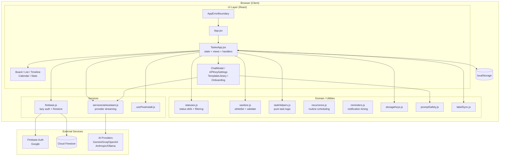
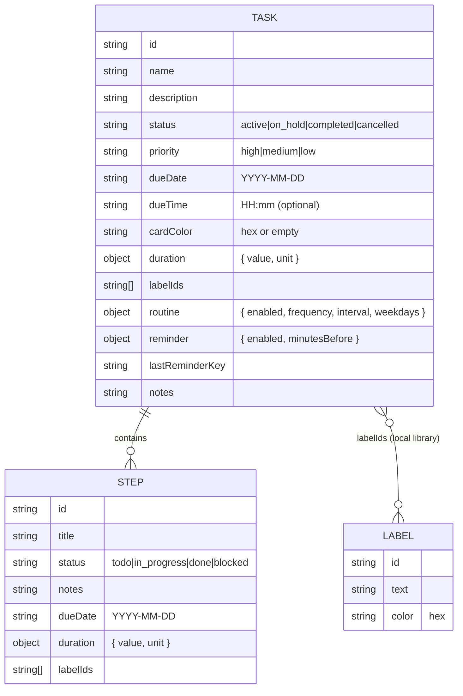
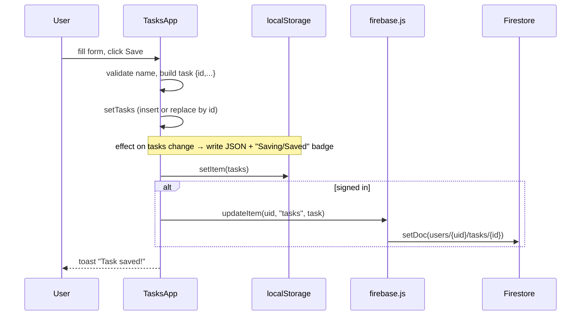
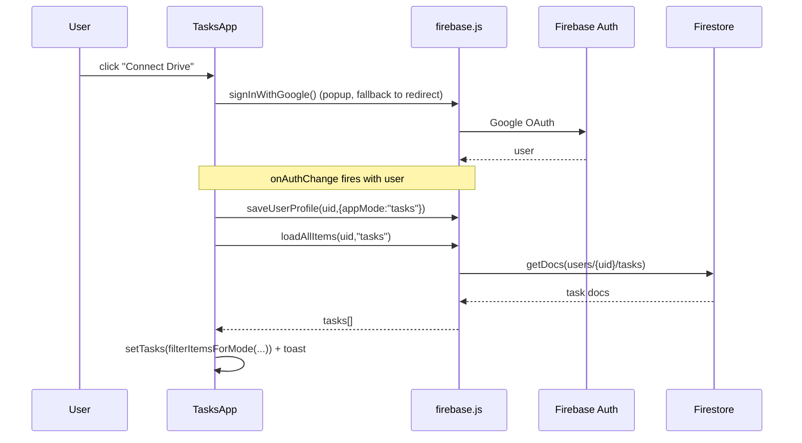
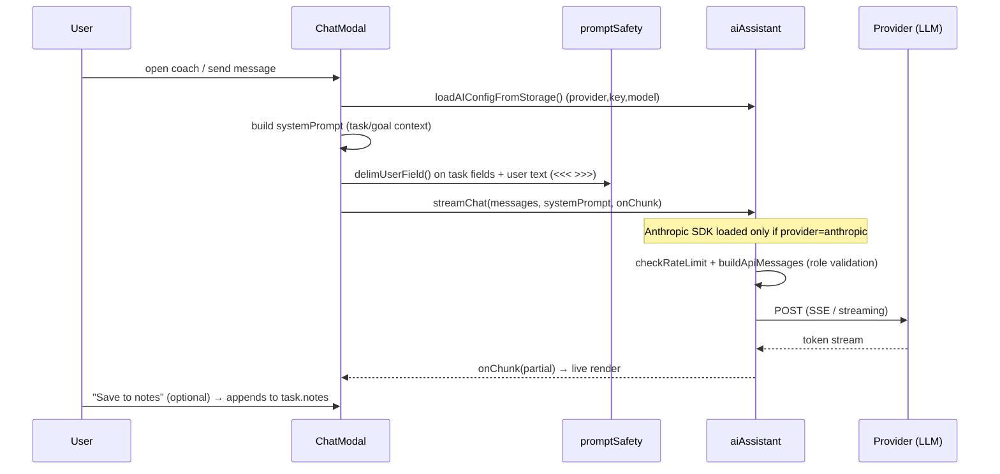

# KanDOne — High Level Design (HLD)

| Field | Value |
| --- | --- |
| Document | High Level Design |
| Product | KanDOne — standalone Kanban task manager |
| Status | Living document |
| Related | [LLD](./LLD.md), `README.md` |
| Owners | KanDOne maintainers |

> This HLD describes **what** the system is, its architecture, external
> integrations and the main runtime flows. For class/function-level detail
> (**how**), see the companion [Low Level Design](./LLD.md).

---

## 1. Overview

KanDOne is a **client-side, offline-first single-page application (SPA)** for
managing tasks on a Kanban board. Each task holds ordered **steps** (sub-tasks),
a status, a priority, a due date and free-text notes. The app renders the same
task data through five views (Board, List/Edit, Timeline, Calendar, Statistics),
optionally syncs to the cloud (Google sign-in + Firestore), and offers an
optional **AI coach** that talks to a user-configured LLM provider.

It was extracted from the *Tasks mode* of the JobFlowTracker project, so a few
identifiers (`getStorageKey`, collection naming, Firebase project) still carry
job-tracker heritage — this is called out where relevant.

### Key characteristics

- **No backend of its own.** All business logic runs in the browser.
- **Local-first.** `localStorage` is the source of truth; cloud sync is optional.
- **Installable PWA.** Works fully offline once loaded.
- **Multilingual.** English, Hebrew (RTL) and French via i18next.
- **Bring-your-own-AI-key.** Keys live only in the user's browser.

---

## 2. Goals & Non-Goals

### Goals
- Let a single user plan tasks with steps and track progress visually.
- Work with zero configuration and no network (offline-first).
- Keep user data private and portable (JSON import/export).
- Offer optional cloud backup/sync per Google account.
- Offer optional, provider-agnostic AI coaching.

### Non-Goals
- Multi-user collaboration / shared boards.
- Server-side business logic or a proprietary backend.
- Team permissions, comments, or real-time co-editing.
- Storing AI keys server-side or proxying AI traffic.

---

## 3. Scope

**In scope:** task CRUD, step CRUD, drag-and-drop status changes, five views,
search/filter (status + label), JSON import/export (tasks + labels), Google auth +
Firestore sync, AI chat/coach, custom labels & card colors, estimated duration,
routine/recurring tasks, due-time scheduling, browser reminders, i18n (en/he/fr),
PWA install.

**Out of scope:** the removed multi-mode (jobseeker/recruiter) UX. The shared
data-model helpers in `statuses.js`/`sanitize.js` still carry those modes for
backward-compatible data cleansing, but the app boots straight into `tasks` mode.

---

## 4. Requirements

### 4.1 Functional
- FR1 — Create, edit, delete tasks; each task can contain ordered steps.
- FR2 — Cycle a step through `todo → in_progress → done → blocked`.
- FR3 — Move a task between status columns via drag-and-drop.
- FR4 — Persist all data to `localStorage` automatically.
- FR5 — Import/export the full task list as JSON.
- FR6 — Optional Google sign-in; on sign-in, load and mirror data in Firestore.
- FR7 — Provide Board / List / Timeline / Calendar / Statistics views.
- FR8 — Optional AI chat: per-task coach, guided template sessions, goals finder.
- FR9 — Localize the UI in en/he/fr, with RTL layout for Hebrew.
- FR10 — Assign custom labels (with colors) to tasks and steps; filter and chart by label.
- FR11 — Set an optional card background color and estimated duration on tasks/steps.
- FR12 — Schedule optional due time (`HH:mm`) alongside due date.
- FR13 — Mark tasks as routines; on completion, reset steps and advance the next due date.
- FR14 — Optional browser reminders before due date/time (while app/PWA is active).
- FR15 — Highlight overdue (past due, non-terminal) tasks on board, list, and detail.
- FR16 — Undo toast for delete task/step/label and for import overwrite.

### 4.2 Non-Functional
- NFR1 — **Offline-first:** all core features work without a network.
- NFR2 — **Privacy:** API keys and data stay client-side unless the user signs in.
- NFR3 — **Security:** Firestore rules restrict each user to their own document tree; user text is delimited before being placed into AI prompts; CSP without `script-src 'unsafe-inline'` (meta + Vercel response header).
- NFR4 — **Performance:** list rendering is paginated (25-at-a-time); derived data is memoised; Firebase, Anthropic SDK, and heavy UI (calendar/modals) load lazily.
- NFR5 — **Installability:** valid PWA manifest + service worker with auto-update.
- NFR6 — **Resilience:** malformed imports/localStorage are sanitised, not fatal; root `AppErrorBoundary` can export local data after a render crash.
- NFR7 — **Accessibility / i18n:** `<html lang/dir>` tracks i18n; locale key parity is tested; dialogs use `role="dialog"` / focus trapping via `useModalA11y`.

---

## 5. Technology Stack

| Layer | Technology |
| --- | --- |
| UI framework | React 19 (function components + hooks) |
| Build/dev | Vite 8 |
| Styling | Tailwind CSS 3 + PostCSS |
| Icons | lucide-react |
| i18n | i18next + react-i18next |
| Cloud | Firebase Auth (Google) + Cloud Firestore |
| AI | Anthropic SDK + `fetch` to Gemini / Groq / OpenAI / Ollama |
| PWA | vite-plugin-pwa (Workbox) |
| Tests | Vitest + Testing Library (jsdom) |
| Hosting | Static hosting (Vercel; see `vercel.json`) |

---

## 6. System Architecture

KanDOne is a layered browser app. The UI layer renders state; a thin
service/persistence layer talks to `localStorage`, Firestore and AI providers.



### 6.1 Layer responsibilities

- **UI layer** — `main.jsx` wraps `<App/>` in `AppErrorBoundary`. `App.jsx`
  boots the app; `TasksApp.jsx` is the single stateful container that owns the
  `tasks` array and all view/modal orchestration. Calendar and settings/chat
  modals are `React.lazy`-loaded. Views and modals are (mostly) presentational.
- **Domain / utilities** — pure modules with no React dependency: status
  definitions (`statuses.js`), input whitelisting (`sanitize.js`), pure task
  helpers (`taskHelpers.js`), label cloud merge (`labelSync.js`), storage keys,
  recurrence/reminders, and prompt-injection hardening (`promptSafety.js`).
- **Services** — side-effecting integrations: `aiAssistant.js` (multi-provider
  streaming; Anthropic SDK imported only when that provider is used),
  `firebase.js` (SDK loaded on first cloud call via `ensureFirebase()`),
  `usePwaInstall.js`.
- **Persistence** — `localStorage` is the always-on local store; Firestore is an
  optional cloud mirror keyed by the signed-in user.

---

## 7. Data Model (high level)

A single entity — the **Task** — with an embedded list of **Steps**. There is no
relational schema; tasks are stored as a JSON array locally and as one document
per task in Firestore. A separate **label library** (`tasksLabelsV1` in
`localStorage`) holds `{ id, text, color }` entries referenced by `labelIds` on
tasks and steps.



- **Task statuses** (`STATUSES_TASKS`): `active`, `on_hold`, `completed`,
  `cancelled`. Terminal statuses: `completed`, `cancelled`.
- **Step statuses**: `todo`, `in_progress`, `done`, `blocked` (cycled on click).
- Field-level schemas, size caps and defaults live in the [LLD](./LLD.md#4-data-structures).

---

## 8. Key Runtime Flows

### 8.1 App load & local hydration

```mermaid
sequenceDiagram
    participant U as User
    participant M as main.jsx
    participant A as App.jsx
    participant T as TasksApp
    participant LS as localStorage

    U->>M: open app
    M->>M: register service worker (PROD)
    M->>M: init i18n (saved language; sync html lang/dir)
    M->>A: render AppErrorBoundary > App
    A->>A: completeRedirectSignIn() (lazy Firebase; resolve pending Google redirect)
    A->>T: render <TasksApp/>
    T->>LS: read tasks key
    T->>T: parseTaskStoragePayload + filterItemsForMode
    T-->>U: render Board with hydrated tasks
```

### 8.2 Create / edit a task (with auto-persist)



Drag-and-drop status changes and step-status cycling follow the same pattern:
update React state → `localStorage` effect persists → best-effort Firestore write
when signed in. When a **routine** task lands on `completed`, `applyTaskStatusChange`
(in `recurrence.js`) resets steps to `todo`, sets status back to `active`, and
computes the next `dueDate` before persisting.

### 8.3 Google sign-in & cloud sync



Writes are **local-first and best-effort to cloud**: the UI never blocks on a
Firestore write, and failures are swallowed so offline editing keeps working.

### 8.4 AI chat / coaching



### 8.5 Import / export

- **Export:** `{ version: 2, tasks, labels }` → download `tasks-backup-<ts>.json`.
- **Import:** accepts legacy task-only arrays **or** v2 objects with optional
  `labels`. Tasks pass through `sanitizeTaskRecords`; labels through
  `sanitizeTaskLabels`. Invalid files are rejected with an alert. Successful
  overwrite offers a toast **Undo** that restores the previous tasks/labels.

### 8.6 Reminders

While the app is open (or installed as a PWA) and notification permission is
granted, `TasksApp` polls every 30 s. For each task with `reminder.enabled`, it
compares the current time to `(dueDate + dueTime) − minutesBefore`. Matching tasks
fire a `Notification` once per occurrence (deduped via `lastReminderKey`).

---

## 9. External Integrations

| Integration | Purpose | Notes |
| --- | --- | --- |
| **Firebase Auth** | Google sign-in | Popup with redirect fallback; redirect result resolved on load. |
| **Cloud Firestore** | Optional cloud mirror | One doc per task under `users/{uid}/tasks/{taskId}`; batched writes (chunks of 490). |
| **AI providers** | Coaching/chat | Gemini, Groq, OpenAI, Anthropic (SDK) and local Ollama. Streaming responses. Keys stored per-browser. |
| **PWA / Workbox** | Offline + install | Precache app shell; `NetworkFirst` runtime caching for Firestore. |
| **Vercel** | Static hosting | SPA + security headers (full CSP) via `vercel.json`. |

The Firebase web config in `firebase.js` is a **public web API key** (not a
secret). Default project is `kandone-a6c91`; users can swap in their own config.

---

## 10. Cross-Cutting Concerns

- **Internationalization** — `i18n.js` loads en/he/fr resources merged with
  per-language template questions. Language persists in `localStorage`
  (`appLanguage`). Both `i18n` init and `TasksApp` keep `<html lang>` /
  `dir` in sync (Hebrew → RTL). Locale key parity is enforced by unit tests.
- **Security & privacy**
  - Firestore rules: a user can read/write only their own `users/{uid}` subtree.
  - AI keys never leave the browser except as auth headers to the chosen provider
    (plaintext `localStorage` is an **accepted** risk — no backend proxy).
  - `sanitize.js` whitelists and size-caps all imported/loaded records (covered
    by unit tests).
  - `promptSafety.delimUserField()` is applied on live coach / goals / simulation
    prompt paths (task names, descriptions, notes, user chat text).
  - CSP: `script-src 'self'` (+ Google/Firebase origins); no `'unsafe-inline'`
    for scripts. Same policy in `index.html` meta and `vercel.json` header.
  - Dependabot watches npm and GitHub Actions weekly.
  - AI calls are rate-limited (3s throttle) outside browser/test environments.
- **Offline & persistence** — `localStorage` is the source of truth; the service
  worker precaches the shell so the app opens offline.
- **Performance** — lazy Firebase + Anthropic; `React.lazy` for Calendar and
  modals; `useMemo` for derived views; list pagination; `npm run build:analyze`
  for local bundle inspection.
- **Error handling** — root `AppErrorBoundary` (reload + export-data); 
  `ChatErrorBoundary` isolates chat crashes; import/parse and network paths fail
  soft (alerts/toasts, swallowed cloud errors). Undo toast for destructive
  deletes and import overwrite.
- **Accessibility** — toast `aria-live`; header icon `aria-label`s; modals use
  `useModalA11y` (dialog role, focus trap, Escape); axe-core in Playwright e2e.

---

## 11. Deployment & Environments

- **Build:** `npm run build` → Vite static bundle in `dist/` (with PWA assets).
  Optional: `npm run build:analyze` opens a rollup visualizer report.
- **Dev:** `npm run dev` (Vite dev server on `:5173`).
- **CI:** lint → unit tests → build; separate Playwright Chromium e2e job.
- **Hosting:** static hosting (Vercel) with CSP and related security headers.
  No server runtime required.
- **Config to run cloud sync under your own account:** replace `firebaseConfig`
  in `src/firebase.js` and deploy `firestore.rules`.

---

## 12. Risks & Future Considerations

| Risk / Limitation | Mitigation / Direction |
| --- | --- |
| `localStorage` size limits for very large boards | JSON export as backup; consider IndexedDB. |
| AI keys readable by malicious extensions / XSS | User-facing security notice; keys opt-in and local. **Accepted** without a backend proxy. |
| Default shared Firebase project | Documented (`kandone-a6c91`); users swap in their own config. |
| Legacy multi-mode helpers add complexity | Isolated in `statuses.js` / sanitize; `tasks` is the only live path. |
| No conflict resolution across devices | Last-write-wins; acceptable for single-user use. |
| Reminders require active app/PWA | No service-worker background scheduling in v1. |
| Board DnD is HTML5-only (no touch / keyboard reorder) | Deferred; phone PWA cannot drag cards yet. |
| Manual card order within a column | Deferred (needs schema `order` + migration). |
| `TasksApp.jsx` remains a large container | Pure helpers extracted; full view split deferred pending careful browser QA. |

---

## 13. Traceability

| Requirement | Primary component(s) |
| --- | --- |
| FR1/FR2 task & step CRUD | `TasksApp.jsx`, `sanitize.js`, `taskHelpers.js` |
| FR3 drag-and-drop | `TasksApp.jsx` (`handleDragStart/Over/Drop`) |
| FR4 local persistence | `TasksApp.jsx` effect, `storageKeys.js` |
| FR5 import/export | `TasksApp.jsx`, `sanitize.js`, undo toast |
| FR6 cloud sync | `firebase.js` (`ensureFirebase`), `firestore.rules`, `labelSync.js` |
| FR7 views | Board/List/Timeline/Stats in `TasksApp.jsx`, lazy `CalendarView.jsx` |
| FR8 AI | `services/aiAssistant.js`, `ChatModal.jsx`, `promptSafety.js` |
| FR9 i18n | `i18n.js`, `locales/*`, locale parity tests |
| FR10 labels | `LabelPicker.jsx`, `labelColors.js`, `sanitize.js` |
| FR11 card color & duration | `CardColorPicker.jsx`, `TasksApp.jsx`, `sanitize.js` |
| FR12–FR14 due time, routines, reminders | `RoutineReminderFields.jsx`, `recurrence.js`, `reminders.js` |
| FR15 overdue | `taskHelpers.isTaskOverdue`, board/list/detail UI |
| FR16 undo | `TasksApp` toast action for delete/import |

See the [LLD](./LLD.md) for the function-by-function realisation of each item.

---

## 14. Audit follow-ups (A–I)

A 2026 full-app audit shipped as PRs **#8–#16** (sections A–I). Highlights:

| Section | Focus | Notable outcomes |
| --- | --- | --- |
| A | Correctness | Local-date parsing, reminder timing, related board bugs |
| B | Data integrity | Cloud/local persistence paths that could drop data |
| C | Dead code | Removed unused JobFlowTracker / interview template surface |
| D | Architecture | `taskHelpers.js`, root `AppErrorBoundary`, real unit tests |
| E | Features | Overdue highlighting, undo toast, calendar dark-mode fix |
| F | A11y / i18n | `html` lang/dir, locale parity, modal a11y, axe e2e |
| G | Performance | Lazy Firebase, Anthropic, Calendar/modals; bundle analyze |
| H | Security | CSP harden + Vercel header, wire `delimUserField`, Dependabot |
| I | Testing / CI | Lint gate, `sanitize.test.js`, Playwright path cleanup |

Deferred items (still open product work) are listed in §12 and in each PR body.
