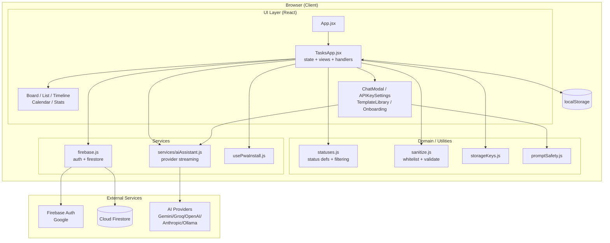
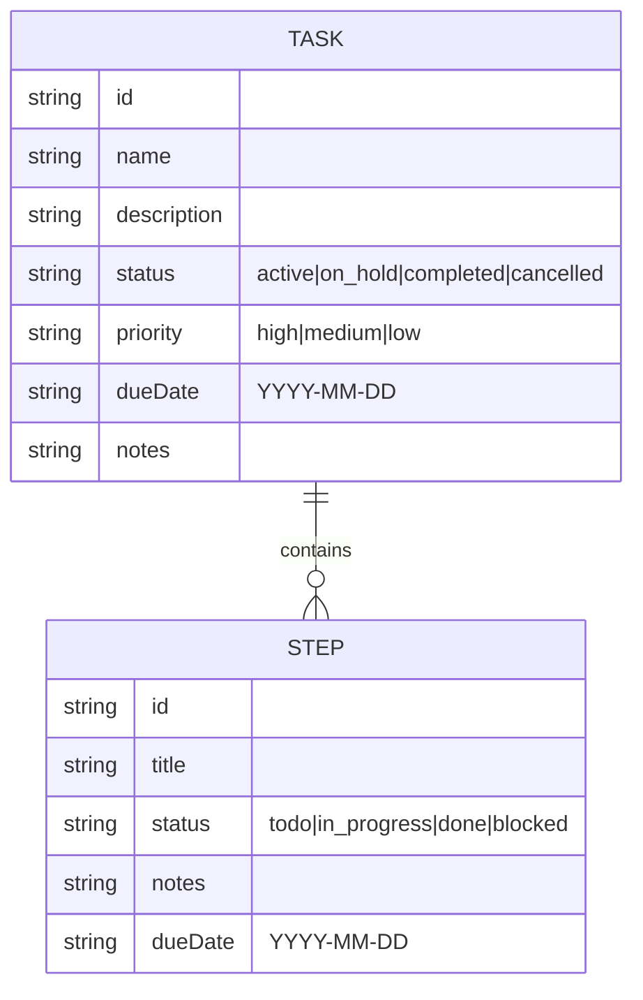
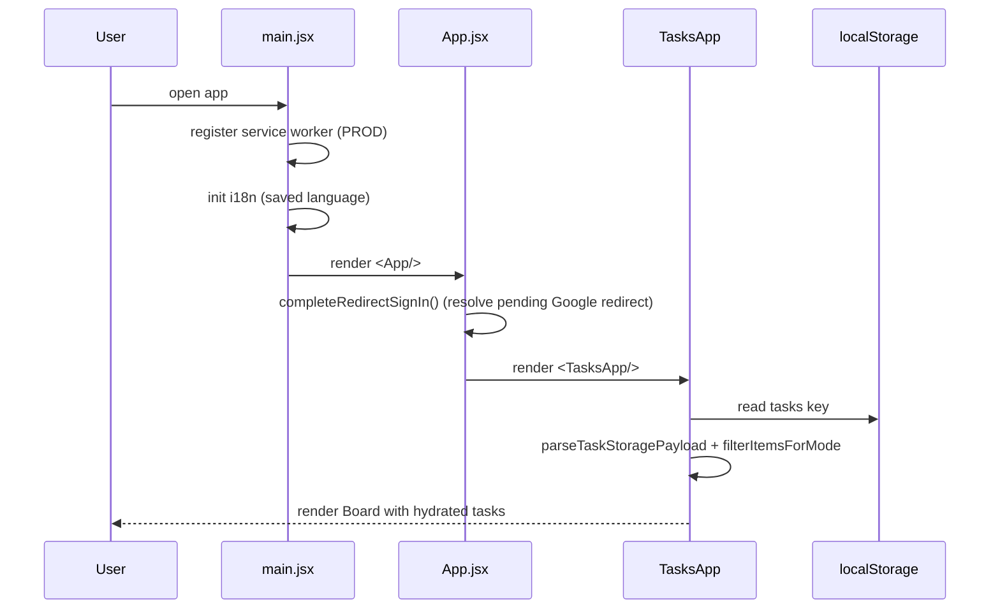
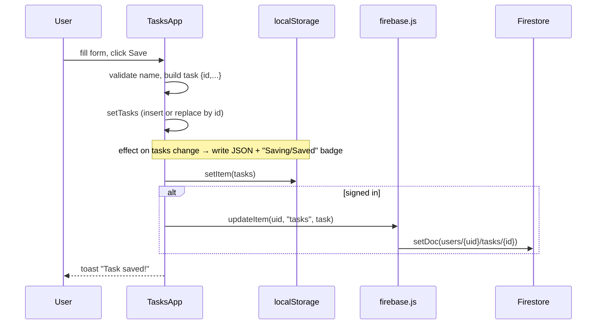
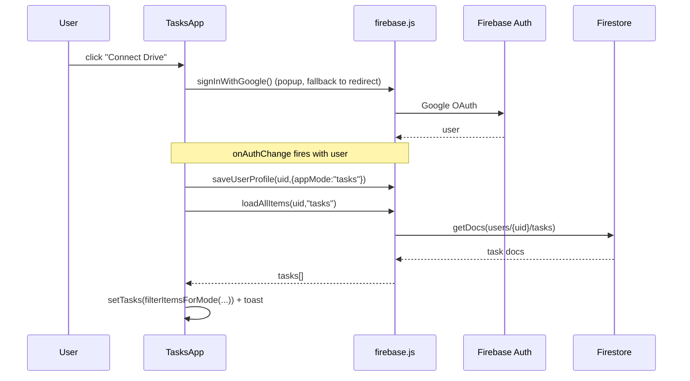
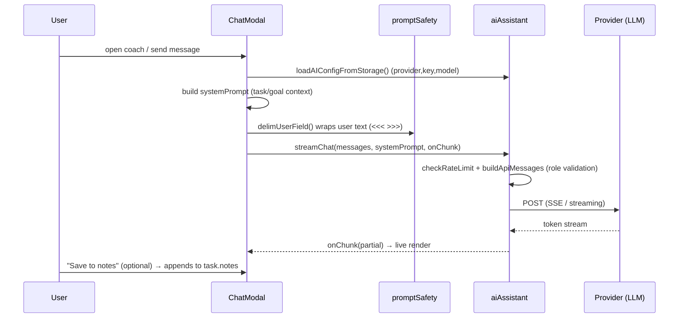

# KanDOne — High Level Design (HLD)

| Field | Value |
| --- | --- |
| Document | High Level Design |
| Product | KanDOne — standalone Kanban task manager |
| Status | Living document |
| Related | [LLD](../lld/lld.md), `README.md` |
| Owners | KanDOne maintainers |

> This HLD describes **what** the system is, its architecture, external
> integrations and the main runtime flows. For class/function-level detail
> (**how**), see the companion [Low Level Design](../lld/lld.md).

---

## 1. Overview

KanDOne is a **client-side, offline-first single-page application (SPA)** for
managing tasks on a Kanban board. Each task holds ordered **steps** (sub-tasks),
a status, a priority, a due date and free-text notes. The app renders the same
task data through five views (Board, List/Edit, Timeline, Calendar, Statistics),
optionally syncs to the cloud (Google sign-in + Firestore), and offers an
optional **AI coach** that talks to a user-configured LLM provider.

It was extracted from the *Tasks mode* of the JobFlowTracker project, so a few
identifiers (`getStorageKey`, collection naming, Firebase project) still carry
job-tracker heritage — this is called out where relevant.

### Key characteristics

- **No backend of its own.** All business logic runs in the browser.
- **Local-first.** `localStorage` is the source of truth; cloud sync is optional.
- **Installable PWA.** Works fully offline once loaded.
- **Multilingual.** English, Hebrew (RTL) and French via i18next.
- **Bring-your-own-AI-key.** Keys live only in the user's browser.

---

## 2. Goals & Non-Goals

### Goals
- Let a single user plan tasks with steps and track progress visually.
- Work with zero configuration and no network (offline-first).
- Keep user data private and portable (JSON import/export).
- Offer optional cloud backup/sync per Google account.
- Offer optional, provider-agnostic AI coaching.

### Non-Goals
- Multi-user collaboration / shared boards.
- Server-side business logic or a proprietary backend.
- Team permissions, comments, or real-time co-editing.
- Storing AI keys server-side or proxying AI traffic.

---

## 3. Scope

**In scope:** task CRUD, step CRUD, drag-and-drop status changes, five views,
search/filter, JSON import/export, Google auth + Firestore sync, AI chat/coach,
i18n (en/he/fr), PWA install.

**Out of scope:** the removed multi-mode (jobseeker/recruiter) UX. The shared
data-model helpers in `statuses.js`/`sanitize.js` still carry those modes for
backward-compatible data cleansing, but the app boots straight into `tasks` mode.

---

## 4. Requirements

### 4.1 Functional
- FR1 — Create, edit, delete tasks; each task can contain ordered steps.
- FR2 — Cycle a step through `todo → in_progress → done → blocked`.
- FR3 — Move a task between status columns via drag-and-drop.
- FR4 — Persist all data to `localStorage` automatically.
- FR5 — Import/export the full task list as JSON.
- FR6 — Optional Google sign-in; on sign-in, load and mirror data in Firestore.
- FR7 — Provide Board / List / Timeline / Calendar / Statistics views.
- FR8 — Optional AI chat: per-task coach, guided template sessions, goals finder.
- FR9 — Localize the UI in en/he/fr, with RTL layout for Hebrew.

### 4.2 Non-Functional
- NFR1 — **Offline-first:** all core features work without a network.
- NFR2 — **Privacy:** API keys and data stay client-side unless the user signs in.
- NFR3 — **Security:** Firestore rules restrict each user to their own document tree; user text is delimited before being placed into AI prompts.
- NFR4 — **Performance:** list rendering is paginated (25-at-a-time); derived data is memoised.
- NFR5 — **Installability:** valid PWA manifest + service worker with auto-update.
- NFR6 — **Resilience:** malformed imports/localStorage are sanitised, not fatal.

---

## 5. Technology Stack

| Layer | Technology |
| --- | --- |
| UI framework | React 19 (function components + hooks) |
| Build/dev | Vite 8 |
| Styling | Tailwind CSS 3 + PostCSS |
| Icons | lucide-react |
| i18n | i18next + react-i18next |
| Cloud | Firebase Auth (Google) + Cloud Firestore |
| AI | Anthropic SDK + `fetch` to Gemini / Groq / OpenAI / Ollama |
| PWA | vite-plugin-pwa (Workbox) |
| Tests | Vitest + Testing Library (jsdom) |
| Hosting | Static hosting (Vercel; see `vercel.json`) |

---

## 6. System Architecture

KanDOne is a layered browser app. The UI layer renders state; a thin
service/persistence layer talks to `localStorage`, Firestore and AI providers.

### 6.1 Layer responsibilities

- **UI layer** — `App.jsx` boots the app; `TasksApp.jsx` is the single stateful
  container that owns the `tasks` array and all view/modal orchestration. Views
  and modals are (mostly) presentational and driven by props/callbacks.
- **Domain / utilities** — pure modules with no React dependency: status
  definitions and mode-filtering (`statuses.js`), input whitelisting
  (`sanitize.js`), storage-key constants (`storageKeys.js`), and prompt-injection
  hardening (`promptSafety.js`).
- **Services** — side-effecting integrations: `aiAssistant.js` (multi-provider
  streaming chat), `firebase.js` (auth + Firestore CRUD), `usePwaInstall.js`
  (install prompt).
- **Persistence** — `localStorage` is the always-on local store; Firestore is an
  optional cloud mirror keyed by the signed-in user.

---

## 7. Data Model (high level)

A single entity — the **Task** — with an embedded list of **Steps**. There is no
relational schema; tasks are stored as a JSON array locally and as one document
per task in Firestore.

- **Task statuses** (`STATUSES_TASKS`): `active`, `on_hold`, `completed`,
  `cancelled`. Terminal statuses: `completed`, `cancelled`.
- **Step statuses**: `todo`, `in_progress`, `done`, `blocked` (cycled on click).
- Field-level schemas, size caps and defaults live in the [LLD](../lld/lld.md#4-data-structures).

---

## 8. Key Runtime Flows

### 8.1 App load & local hydration

### 8.2 Create / edit a task (with auto-persist)

Drag-and-drop status changes and step-status cycling follow the same pattern:
update React state → `localStorage` effect persists → best-effort Firestore write
when signed in.

### 8.3 Google sign-in & cloud sync

Writes are **local-first and best-effort to cloud**: the UI never blocks on a
Firestore write, and failures are swallowed so offline editing keeps working.

### 8.4 AI chat / coaching

### 8.5 Import / export

- **Export:** serialise `tasks` → `Blob` → download `tasks-backup-<ts>.json`.
- **Import:** read file → `JSON.parse` → `sanitizeTaskRecords` → `filterItemsForMode`
  → replace list (and cloud batch-save if signed in). Invalid files are rejected
  with an alert; nothing is persisted.

---

## 9. External Integrations

| Integration | Purpose | Notes |
| --- | --- | --- |
| **Firebase Auth** | Google sign-in | Popup with redirect fallback; redirect result resolved on load. |
| **Cloud Firestore** | Optional cloud mirror | One doc per task under `users/{uid}/tasks/{taskId}`; batched writes (chunks of 490). |
| **AI providers** | Coaching/chat | Gemini, Groq, OpenAI, Anthropic (SDK) and local Ollama. Streaming responses. Keys stored per-browser. |
| **PWA / Workbox** | Offline + install | Precache app shell; `NetworkFirst` runtime caching for Firestore. |
| **Vercel** | Static hosting | SPA served as static assets (`vercel.json`). |

The Firebase web config in `firebase.js` is a **public web API key** (not a
secret). It points at the original JobFlowTracker project; users can swap in
their own project config.

---

## 10. Cross-Cutting Concerns

- **Internationalization** — `i18n.js` loads en/he/fr resources merged with
  per-language template questions. Language persists in `localStorage`
  (`appLanguage`); Hebrew triggers `dir="rtl"` and mirrored layout/icons.
- **Security & privacy**
  - Firestore rules: a user can read/write only their own `users/{uid}` subtree.
  - AI keys never leave the browser except as auth headers to the chosen provider.
  - `sanitize.js` whitelists and size-caps all imported/loaded records.
  - `promptSafety.delimUserField()` strips control chars/angle brackets and wraps
    user data in `<<< >>>` to reduce prompt-injection risk.
  - AI calls are rate-limited (3s throttle) outside browser/test environments.
- **Offline & persistence** — `localStorage` is the source of truth; the service
  worker precaches the shell so the app opens offline.
- **Performance** — `useMemo` for derived views (filtered list, stats, calendar,
  timeline); list pagination via `visibleCount`; best-effort async cloud writes.
- **Error handling** — `ChatErrorBoundary` isolates chat crashes; import/parse
  and network paths fail soft (alerts/toasts, swallowed cloud errors).

---

## 11. Deployment & Environments

- **Build:** `npm run build` → Vite static bundle in `dist/` (with PWA assets).
- **Dev:** `npm run dev` (Vite dev server on `:5173`).
- **Hosting:** static hosting (Vercel). No server runtime required.
- **Config to run cloud sync under your own account:** replace `firebaseConfig`
  in `src/firebase.js` and deploy `firestore.rules`.

---

## 12. Risks & Future Considerations

| Risk / Limitation | Mitigation / Direction |
| --- | --- |
| `localStorage` size limits for very large boards | JSON export as backup; consider IndexedDB. |
| AI keys readable by malicious extensions | User-facing security notice; keys are opt-in and local. |
| Shared JobFlowTracker Firebase project by default | Documented; users swap in their own config. |
| Legacy multi-mode helpers add complexity | Isolated in `statuses.js`; `tasks` path is the only live one. |
| No conflict resolution across devices | Last-write-wins; acceptable for single-user use. |

---

## 13. Traceability

| Requirement | Primary component(s) |
| --- | --- |
| FR1/FR2 task & step CRUD | `TasksApp.jsx`, `sanitize.js` |
| FR3 drag-and-drop | `TasksApp.jsx` (`handleDragStart/Over/Drop`) |
| FR4 local persistence | `TasksApp.jsx` effect, `storageKeys.js` |
| FR5 import/export | `TasksApp.jsx`, `sanitize.js` |
| FR6 cloud sync | `firebase.js`, `firestore.rules` |
| FR7 views | Board/List/Timeline/Stats in `TasksApp.jsx`, `CalendarView.jsx` |
| FR8 AI | `services/aiAssistant.js`, `ChatModal.jsx`, `promptSafety.js` |
| FR9 i18n | `i18n.js`, `locales/*` |

See the [LLD](../lld/lld.md) for the function-by-function realisation of each item.
