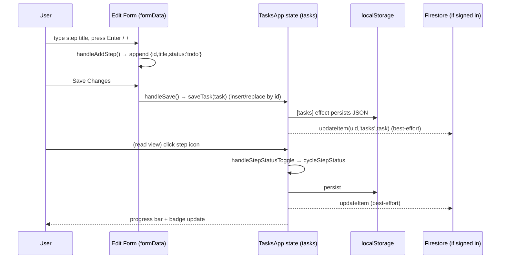

# KanDOne — Low Level Design (LLD)

| Field | Value |
| --- | --- |
| Document | Low Level Design |
| Product | KanDOne — standalone Kanban task manager |
| Status | Living document |
| Parent | [HLD](../hld/hld.md) |
| Scope | Module, function, data-structure and flow detail |

> This LLD explains **how** each module is implemented and how control/data flow
> through them. Read the [HLD](../hld/hld.md) first for the big picture.

---

## 1. Source Layout

```
src/
├── main.jsx                    # React root, SW registration, i18n bootstrap
├── App.jsx                     # resolves redirect sign-in, renders TasksApp
├── TasksApp.jsx                # stateful container: tasks, views, handlers
├── firebase.js                 # auth + Firestore CRUD
├── statuses.js                 # status defs, collection/keys, mode filtering
├── sanitize.js                 # ID gen, whitelisting, import parsing
├── storageKeys.js              # localStorage key constants + helpers
├── i18n.js                     # i18next init (en/he/fr + template questions)
├── usePwaInstall.js            # PWA install prompt hook
├── services/
│   └── aiAssistant.js          # multi-provider streaming AI client
├── components/
│   ├── ChatModal.jsx           # AI chat/coach UI + streaming state machine
│   ├── CalendarView.jsx        # month grid + day detail
│   ├── APIKeySettings.jsx      # AI provider/key settings modal
│   ├── TemplateLibrary.jsx     # coaching prompt catalog
│   ├── Onboarding.jsx          # welcome/tour modal
│   └── AppBrandMark.jsx        # logo SVG
├── utils/
│   ├── promptSafety.js         # delimUserField() prompt hardening
│   └── templateQuestions.js    # localized question helpers
├── data/
│   ├── taskTemplates.js        # coaching prompt sets
│   └── interviewTemplates.js   # (legacy) interview prompt sets
└── locales/                    # en/he/fr JSON + templateQuestions/*.js
```

---

## 2. Entry Points

### 2.1 `main.jsx`
- Creates the React root and renders `<App/>` inside `<StrictMode>`.
- Registers the service worker **only in production** (`import.meta.env.PROD`)
  via `registerSW({ immediate: true })`.
- Imports `./i18n` for its init side effect and `./index.css`.

### 2.2 `App.jsx`
- On mount, calls `completeRedirectSignIn()` to resolve a pending Google
  **redirect** sign-in (errors swallowed), then renders `<TasksApp/>`.
- Deliberately thin — the multi-mode selector from the parent project is gone;
  the app boots straight into tasks.

---

## 3. `TasksApp.jsx` — the container

`MODE = 'tasks'` is a module constant used for storage keys and collection names.

### 3.1 State

| State | Purpose |
| --- | --- |
| `tasks` | The task array; lazily initialised from `localStorage` via `parseTaskStoragePayload` + `filterItemsForMode`. |
| `selectedId` / `isEditing` | Which task is open and whether the form is in edit mode. |
| `formData` | Working copy for the add/edit form (`makeInitialTask()` default). |
| `activeTab` | Current view: `board \| list \| timeline \| calendar \| stats`. |
| `searchQuery` / `statusFilter` | List filters. |
| `toastMessage` / `isSaved` / `syncing` | Transient UI feedback. |
| `user` | Firebase user (or `null`). |
| `newStepTitle` | Buffer for the "add step" input. |
| `visibleCount` | List pagination window (starts at 25). |
| `mobileMenuOpen`, `showTemplates`, `showAISettings`, `chatOpen`, `showGoalsFinder`, `simulationData`, `showTasksWelcome` | Modal/menu toggles. |

Refs: `dragTaskId` (current drag), `fileInputRef` (import), `isSavingRef`
(re-entrancy guard for save).

### 3.2 Effects

| Effect (deps) | Behaviour |
| --- | --- |
| persist (`[tasks]`) | Writes `JSON.stringify(tasks)` to the tasks key; flips `isSaved` false→true after 800ms to drive the header badge. |
| AI init (`[]`) | Reads `aiProvider/aiApiKey/aiModel/ollamaUrl` from `localStorage` and calls `initAI`. |
| auth (`[]`) | Subscribes via `onAuthChange`; on login saves profile, loads cloud tasks, merges into state, toasts. Returns unsub. |
| keyboard (`[openNewForm]`) | Global shortcuts: `n`=new task, `Esc`=close (ignored while typing in inputs). |
| history (`[]`) | `popstate` listener restores `activeTab`/`selectedId` for browser back/forward. |

### 3.3 Persistence & CRUD helpers

- `saveTasks(newTasks)` — replace whole list + best-effort `batchSaveItems` to cloud.
- `saveTask(task)` — insert-or-replace by `id` (prepends new tasks) + `updateItem`.
- `deleteTask(id)` — filter out by id + `deleteItem`.
- `handleSave()` — validates non-empty name (guarded by `isSavingRef`), assigns
  `id` (`formData.id || Date.now().toString()`), calls `saveTask`, closes form.
- `handleDelete(id)` — `window.confirm` then `deleteTask`.

All cloud calls are wrapped in `try/catch` and swallow errors so local editing
never breaks offline.

### 3.4 Step operations

- `cycleStepStatus(current)` (module-level) advances `todo → in_progress → done → blocked → todo`.
- `handleStepStatusToggle(taskId, stepId)` — cycles a saved task's step and best-effort cloud-updates that task.
- `handleFormStepToggle(stepId)` / `handleAddStep()` / `handleDeleteStep(stepId)` — operate on `formData.steps` during editing.

### 3.5 Drag-and-drop (Board)

`handleDragStart(taskId)` stores the id in `dragTaskId`; `handleDragOver`
`preventDefault`s; `handleDrop(statusId)` sets the dragged task's `status`,
best-effort cloud-updates, clears the ref, toasts.

### 3.6 Import / export

- `handleExport()` — `Blob([...tasks], application/json)` → anchor download `tasks-backup-<ts>.json`.
- `handleImport(e)` — `FileReader` → `JSON.parse` → must be array →
  `sanitizeTaskRecords` → `filterItemsForMode` → `saveTasks`. Empty/invalid →
  alert; input value reset so re-selecting the same file re-fires `change`.

### 3.7 Derived data (memoised)

| Memo | Contents |
| --- | --- |
| `filteredTasks` | `tasks` filtered by `statusFilter` and case-insensitive `searchQuery` over name/description. |
| `stats` | totals, active/completed counts, step totals, `byStatus` map. |
| `calendarEvents` | one event per task due date + per step due date (`type: 'task' \| 'step'`). |
| `timelineEvents` | task + step events sorted by date; steps flagged `overdue` when after the task due date. |

### 3.8 Rendering

`TasksApp` returns a header (brand, save badge, add, auth, install, language,
export/import, template/goals/settings/welcome buttons + mobile overflow menu),
a tab bar, and the active view. Render helpers:

- `renderBoard()` — one column per non-empty status; draggable cards showing
  priority, due date, `renderProgressBar`, and next pending step. Empty state
  invites first task / welcome.
- `renderList()` — master/detail: searchable/filterable list (paginated with
  "Load more") + `renderDetailPanel()`. Mobile shows list *or* detail with a
  back button.
- `renderDetailPanel()` — edit form when `isEditing`, else read-only task detail
  (status/priority/due badges, description, progress, steps via `renderStepRow`,
  notes), else empty prompt.
- `renderStepRow(step, editable, taskId, taskDueDate)` — shared step renderer;
  editable variant exposes title/notes/dueDate inputs and an over-due-date
  warning when a step date exceeds the task due date.
- `renderStats()` — summary cards + per-status bars + overall step completion.
- `renderTimeline()` — vertical timeline (RTL-aware borders/dots) of task/step
  events; overdue steps highlighted.
- Calendar tab delegates to `<CalendarView/>` with `calendarEvents`.

Modals mounted conditionally at the end: `Onboarding`, `APIKeySettings`,
`TemplateLibrary`, and three `ChatModal` instances (general coach, template
simulation, goals finder) keyed to reset state per session. A floating Sparkles
button opens the general coach.

### 3.9 Navigation

`navigateTo(tab, taskId?)` sets tab/selection and `history.pushState`; the
`popstate` effect restores state, giving working browser back/forward.

---

## 4. Data Structures

### 4.1 Task (canonical, produced by `sanitizeTaskRecords`)
```js
{
  id: string,          // <=64 chars; generated if absent
  name: string,        // 'Unnamed' if empty
  description: string,
  status: 'active' | 'on_hold' | 'completed' | 'cancelled',   // default 'active'
  priority: 'high' | 'medium' | 'low',                        // default 'medium'
  dueDate: string,     // 'YYYY-MM-DD' or ''
  steps: Step[],       // capped at 200
  notes: string,
}
```

### 4.2 Step
```js
{
  id: string,          // <=64 chars; generated if absent
  title: string,
  status: 'todo' | 'in_progress' | 'done' | 'blocked',        // default 'todo'
  notes: string,
  dueDate: string,     // 'YYYY-MM-DD' or ''
}
```

Caps: ≤10,000 tasks per import, ≤200 steps per task, string coercion via
`safeStr`. Unknown status/priority values fall back to defaults.

---

## 5. Domain / Utility Modules

### 5.1 `statuses.js`
- `STATUSES_TASKS` — `[active, on_hold, completed, cancelled]` with Tailwind color
  classes; `STEP_STATUSES`; `TASKS_TERMINAL_STATUSES = [completed, cancelled]`.
- `getCollectionName(mode)` — `tasks → 'tasks'` (also `candidates`/`companies`
  for legacy modes) → the Firestore subcollection name.
- `getStorageKey(mode)` — `jobTrackerAppV2Data_${mode}` (heritage key name).
- `filterItemsForMode(items, mode)` — for `tasks`, keeps records that look like
  tasks (have a `steps` array or a task-only/blank status) and rejects records
  bearing job-tracker shapes (`interviews`, `linkedinCompany`, …). Guards against
  cross-mode data bleed in shared storage. Also contains jobseeker/recruiter
  heuristics used only by legacy data.
- Legacy exports (`STATUSES_JOBSEEKER/RECRUITER`, funnel/terminal helpers,
  `resolveInitialAppMode`) are retained for data compatibility but unused by the
  live tasks UI.

### 5.2 `sanitize.js`
- `generateId()` — 12 random bytes via `crypto.getRandomValues` → hex; falls back
  to `timestamp-random` when crypto is unavailable.
- `safeStr(val)` — null-safe string coercion (objects → JSON).
- `sanitizeTaskSteps(steps)` — whitelist step fields, validate status, cap 200.
- `sanitizeTaskRecords(rows)` — whitelist task fields, validate status/priority,
  cap 10,000; the single source of truth for a well-formed task.
- `parseTaskStoragePayload(raw)` — parse localStorage JSON → sanitized tasks (`[]`
  on any error).
- (`sanitizeTrackerRecords` / `parseTrackerImportPayload` remain for legacy
  job/recruiter data.)

### 5.3 `storageKeys.js`
- `STORAGE_KEYS` — canonical keys (`appMode`, onboarding/welcome flags).
- `getEnabledModes()` / `APP_MODES` — legacy mode config helpers.
- `E2E_AI_STORAGE`, `E2E_MODE_INIT` — fixtures consumed by e2e/unit tests to
  seed a ready state.

### 5.4 `utils/promptSafety.js`
- `delimUserField(value, maxLen=500)` — slices, strips `\n\r\t` and `<>`, trims,
  wraps in `<<< >>>`. Applied to every user-controlled value interpolated into an
  AI prompt to bound it as literal data.

### 5.5 `utils/templateQuestions.js`
- `getLocalizedQuestions(t, isTasks, categoryKey, fallback)` — reads a translated
  array from i18next or falls back to the raw template list.
- `getLocalizedCategoryLabel(...)` and `formatQuestionList(questions)` — build a
  numbered prompt list for coaching sessions.

### 5.6 `data/taskTemplates.js`
`TASK_TEMPLATES` — six coaching categories (planning, breakdown, execution,
review, collaboration, retrospective), each with `label`, `icon`, `color`, and a
set of reflective `questions` used to seed a guided AI session.

---

## 6. Services

### 6.1 `firebase.js`

Initialises the Firebase app; exports `auth` and `db`.

| Function | Responsibility |
| --- | --- |
| `signInWithGoogle()` | Popup sign-in; on popup/internal errors falls back to `signInWithRedirect`. |
| `completeRedirectSignIn()` | Resolves a pending redirect result on load. |
| `signOut()` / `onAuthChange(cb)` | Sign out / subscribe to auth state. |
| `formatSignInError(err)` | Maps Firebase error codes/messages to friendly guidance (popup blocked, unauthorized domain, API-key referrer, …). |
| `loadUserProfile/saveUserProfile(uid[,data])` | Read/merge the `users/{uid}` root doc. |
| `loadAllItems(uid, mode)` | `getDocs(users/{uid}/{collection})`; for jobseeker only, migrates a legacy root-doc `companies` array into the subcollection. |
| `updateItem/deleteItem(uid, mode, ...)` | `setDoc`/`deleteDoc` a single item doc. |
| `batchSaveItems(uid, mode, items)` | Chunked `writeBatch` commits (490 per batch — under Firestore's 500 op limit). |
| `loadAll*/update*/batchSave*` (companies) | Thin jobseeker-mode aliases (legacy). |

Firestore layout used by tasks: `users/{uid}/tasks/{taskId}` → the task object;
`users/{uid}` root doc stores `{ appMode }` profile data.

### 6.2 `services/aiAssistant.js`

Provider-agnostic streaming AI client.

- `PROVIDERS` — metadata for `gemini`, `groq`, `ollama`, `anthropic`, `openai`
  (default model, placeholder, info URL, `free`/`noKey` flags).
- **Config** — module-level `config`; `initAI(provider, key, model, ollamaUrl)`
  and `loadAIConfigFromStorage()` (also dispatches the `ai-config-updated`
  window event and returns readiness). `isAIReady()` — true for Ollama or when a
  key is present. `getCurrentProvider()`.
- **Rate limiting** — `checkRateLimit(key)` enforces a 3s throttle per action;
  disabled in browser and Node test environments (`_setRateLimitingEnabled`,
  `_resetRateLimitForTests` for tests).
- **Message normalisation** — `buildApiMessages(uiMessages, {appendSimBegin})`
  validates roles (`user`/`assistant`), caps content to 4000 chars, drops the
  `__sim_start__` trigger, enforces user-first ordering and merges consecutive
  same-role turns (required by Anthropic/Gemini).
- **Streaming**
  - `streamChat(messages, systemPrompt, onChunk)` — multi-turn chat; branches per
    provider (Gemini SSE, Anthropic SDK, Ollama NDJSON, OpenAI/Groq SSE via
    `streamOpenAICompat`). Emits cumulative text through `onChunk`.
  - `runStream(prompt, onChunk)` — single-prompt helper for the one-shot coaching
    functions.
  - `streamGemini`, `streamOpenAICompat`, `streamOllama`, `streamAnthropic` —
    provider-specific parsers. `validateOllamaUrl` enforces HTTPS unless localhost.
- **System-prompt builders** — `getGoalsTasksSystemPrompt(tasks, lang)` (used by
  the tasks app) plus legacy job/recruiter builders and one-shot helpers
  (`getInterviewPrep`, `analyzeRejection`, `analyzePatterns`, etc.) retained from
  the parent project.

### 6.3 `usePwaInstall.js`
Captures `beforeinstallprompt`, detects iOS/standalone, exposes
`{ canInstall, runInstall, isIOS, isStandalone, installPrompt }`. `runInstall(t)`
triggers the native prompt or shows an OS-specific hint.

---

## 7. Components

### 7.1 `ChatModal.jsx`
The AI chat surface and its streaming state machine.

- Wrapped by `ChatErrorBoundary` (class component) which shows a fallback on
  render errors and resets when `resetKey`/`sessionKey` changes.
- `ChatModalInner` state: `messages`, `input`, `loading`, `error`, plus refs
  `sendingRef` (re-entrancy), `mountedRef` (avoid setState after unmount),
  `autoStartGen` (guards duplicate auto-starts).
- **System prompt** — `systemPromptOverride` (simulation/goals) or
  `buildTaskCoachPrompt(task)` for tasks, or a job prompt otherwise.
- **`send(textOverride)`** — the core flow: guard empty/duplicate, ensure AI
  ready (else open settings), append user + placeholder assistant message, call
  `streamChat` with a `patchStreamingAssistant` chunk handler, finalise streaming
  flag, and on error drop the streaming message and surface a provider-aware
  message. `SIM_TRIGGER` (`__sim_start__`) drives auto-start without a visible
  user bubble.
- **Auto-start** — when `autoStart` and AI is ready, fires `SIM_TRIGGER` once
  (150ms debounce, generation-guarded) so template/goals sessions open talking.
- **`sessionKey` effect** resets all chat state so reused modal instances start
  clean per task/session.
- Presentational `Message` renders `**bold**` via `MarkdownText`, a streaming
  caret, and an optional "Save to notes" action (`onSaveToTask` → appends to task
  notes in `TasksApp`).

### 7.2 `CalendarView.jsx`
Self-contained month calendar. Buckets `events` by `date.slice(0,10)`
(`eventsByDay`), builds leading blanks + day cells, renders up to 3 chips per day
with "+N more", a day-detail side panel, and a legend filtered by `legendTypes`
(tasks pass `['task','step']`). RTL-aware navigation; forces light colors to
survive OS dark mode. `onEventClick(ev)` bubbles up to `navigateTo('list', parentId)`.

### 7.3 `APIKeySettings.jsx`
Provider/key settings modal. Local state seeded from `localStorage`; provider
grid (`PROVIDER_ORDER`), key or Ollama-URL input (with show/hide), optional model
override, and a "get key" link. `handleSave` writes `aiProvider/aiApiKey/aiModel/
ollamaUrl` and calls `loadAIConfigFromStorage()` (which notifies open chats).
`handleClear` removes keys and reloads. Shows a persistent security notice.

### 7.4 Other components
- `TemplateLibrary.jsx` — searchable catalog of coaching categories; selecting one
  calls `onStartSimulation(categoryKey)` → `handleStartSimulation` builds a coach
  system prompt and opens a `ChatModal`.
- `Onboarding.jsx` — welcome/tour modal (tasks variant) with hooks to add a first
  task or open AI settings.
- `AppBrandMark.jsx` — inline SVG logo used in header/empty states.

---

## 8. Internationalization (`i18n.js`)
Initialises i18next with `initReactI18next`; merges base locale JSON (en/he/fr)
with per-language `templateQuestions` (interview/task question arrays). Initial
language from `localStorage.appLanguage` (fallback `en`); `escapeValue:false`
because React escapes. Components call `useTranslation()`; `TasksApp` derives
`isRTL = language === 'he'` to flip layout, and a namespaced `tt(key, fb)` helper
prefixes `tasks.`.

---

## 9. Detailed Flow: add a step then complete it



---

## 10. Firestore Structure & Security

```
users/{uid}                      # profile doc: { appMode: 'tasks', ... }
users/{uid}/tasks/{taskId}       # one document per task (the Task object)
```

`firestore.rules` (v2): under `users/{userId}` (and every nested document),
`allow read, write: if request.auth != null && request.auth.uid == userId;`.
A signed-in user can only ever touch their own subtree; everything else is denied
by default.

---

## 11. Build & PWA Config (`vite.config.js`)
- React plugin + `VitePWA({ registerType:'autoUpdate' })`.
- Manifest: name/short_name `KanDOne`, theme `#059669`, standalone display, icon
  set; precache globs cover `js,css,html,ico,png,svg`.
- Runtime caching: `NetworkFirst` for `firebaseio.com` and
  `firestore.googleapis.com` so cloud reads work then fall back to cache.
- Vitest block: `jsdom` env, globals on, excludes `node_modules` and `e2e`.

---

## 12. Test Strategy
`src/__tests__/TasksApp.logic.test.js` unit-tests the pure logic mirrored from
`TasksApp` (rather than mounting the whole tree):

- Step status cycling (including unknown → `todo`).
- `getProgress` (null when no steps; correct done/total; non-array safe).
- Save de-duplication (insert vs replace by id; prepend order).
- Step add/delete/update immutability.
- Calendar event building (task + step dates; omit dateless steps).
- Timeline overdue detection (step date vs task due date; sorting).

Run with `npm test` (Vitest). E2E specs live under `e2e/` (excluded from Vitest)
and rely on the `storageKeys.js` seed fixtures.

Practical guidance: keep the canonical logic (`sanitizeTaskRecords`,
`cycleStepStatus`, event builders) pure and mirrored in tests; when changing the
task/step schema, update `sanitize.js`, the data-structure section above, and the
mirrored test helpers together.

---

## 13. Cross-References
- Architecture, flows, requirements → [HLD](../hld/hld.md)
- Status/collection/key rules → `src/statuses.js`
- Data whitelisting → `src/sanitize.js`
- AI providers & streaming → `src/services/aiAssistant.js`
- Cloud rules → `firestore.rules`
